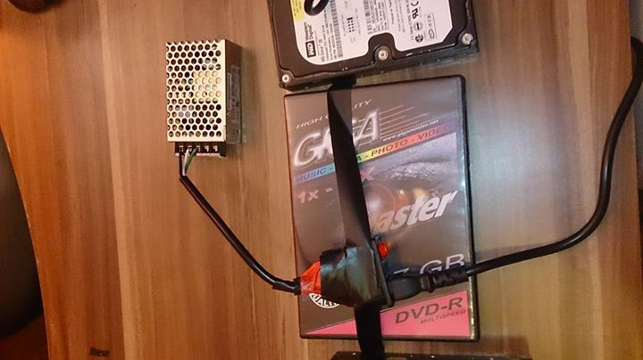

# "Brain transplant" of my old AMIGA500

WRITTEN: October 14, 2014

### INDRODUCTION

This Sunday morning i decided to mess around with my old Amiga collecting dust for the last 15 years and turn it into something useful and cool again :) Back in the day it was an amazing computer, with amazing games and programs. I learned to program and written my first programs on the Amiga500. It's just amazing what it could do with a Motorola 68000 7Mhz CPU and 1Mb of ram (expanded, a basic system had 512kb), thanks to a very smart architecture and design, most of the sound processing, video/animation/collision detection, I/O, was performed in hardware by specially designed chips alleviating considerably the burden from the CPU.

My plan is to replace the amiga motherboard with a Raspberry PI and run Raspbian or i might end up using an Odroid with an ARM Cortex-A9 Quad-core 1.7Ghz CPU for more power and run Ubuntu 14.04 on it. Will mod the OS to somewhat resemble the old Amiga OS. It will be able to do everything a modern computer do, and will ofc run an Amiga emulator so old Amiga games and programs can be used on it.

I ended up using the Odroid, the Rpi at the time was too slow to run Amiga emulation smoothly.

I want to mount everything in the A500 case, use the original integrated keyboard, be able to use the original joysticks and game controlers, have all leds working, keep the joysticks/audio/serial connectors. Replace the original video output with a HDMI output. Replace the parallel connector on the back with 4 USB connectors.

In the bottom expansion card compartment i will mount a HDD, this will make it easily accessible and replaceable.

The Rasbery PI/Odroid OS SD card will be easily accessible from the side expansion slot.

## Step1: Disassembly and cleaning

Removed the metal guard, carefully removed all componets. Cleaned everying from dust, rust, battery spill, ecc and cleaned the plastic.
Carefully cleaned the motherboard, stored for amiga repairs or future use.

## Step 2: keyboard and joystick interface.

I used an Arduino Leonardo microcontroler to turn the old custom made Amiga500 keyboard to a standard USB Keyboard. The same microcontroler handle the joysticks and make them appear and behave like standard USB Game controlers.

The program for the Arduino Leonardo microcontroler:

[a500_keyboard_leonardo.ino](https://github.com/arvvoid/amiga.undead/blob/master/leonardo_a500_keyboard/a500_keyboard_leonardo.ino)

[PIN OUT](https://github.com/arvvoid/amiga.undead/blob/master/leonardo_a500_keyboard/pins.txt)

The joysticks connectors on the amiga motherboard turned to be unusable. It's very hard to pull them out from the board without breaking them. I will have to buy 2 DB9 connectors.

In the meanwhile i tested the joysticks by connecting them directly to the microcontroler pins and all works fine, so when i get the connectors only cosmetic work is left to do.

## Step 3: Testing the power connector and power supply.

I put together a power connector with a on/off switch and it have a 1A easily replaceable fuse.

The PSU take in input 220V/110V 0.7A and outputs 5V 5A enough to power the odroid board, a powered USB hub witch will power the HDD and the Arduino microcontroler, eventual fan if needed. It's a switching high performance PSU, waste very little power with no load.

It will be a very very low power consumption system and very quite.

## Step 4: Chosing the device to use and os

After some testing the Raspberry PI turned to be too slow for this project as expected.

So i will use the Odroid U3 dev board, it cost around 60$. It have an ARM Cortex-A9 Quad-core 1.7Ghz CPU 2GB of Ram and Mali-400 Open GL ES 2.0 quad core GPU.

EDIT: Now more and better options are availible (will upgrade it and make a new version soon)

I tried out and benchmarked pretty much al the OS that run on the ARM architecture for this setup.

I ended up using this great image found on HardKernell forums: [Game Station Turbo](https://forum.odroid.com/viewtopic.php?f=11&t=2684)

After some customization and configuration to suite my exact needs all was finally ready :D

Also moved the home folder on a dedicated HDD, while the system is running from the SD/MMC card.

EDIT: I plan to upgrade the system soon and will see the OS options availible now, havet done any work on this in years.

## Step 5: Internal layout

After some experimenting and trial and error found the best layout. All is placed so it's easy to connect and replace in the future. The odroid board is placed so the SD card can be easily replaced without opening the whole thig up just the lateral expansion slot, so experimenting with various OS in the future is easy. The HDD is also replaceable from the bottom expansion slot without opening everything up.

## Step 6: Making the power and drive led work.

For the red power led there is not much to say. Where there is power running through the system it should be on, so is simply connected to the PSU directly.

For the green drive led i wanted it to behave like the original drive led on the Amiga.

So the idea is to control that led with a program running on the odroid board to light it up at the I/O rhythm :D It doesn't metter if it is the internal SD card, external HDD, external CD/DVD, memory card, USB Stick all will make the led light up while there is I/O activity.

There are 3 free programmable output pins on the Odroid board out of the box, more can be used by recompiling the kernel to turn off the UART module and some other modules. They can both output or work as sensor input.

For the led i need just one, so good to go.

The led works ta 5v (or better say that led are actually 2 green leds combined together rated at 5V).

So obviously is impossible to power it directly from the gpio pin.

I put a little breadboard above the Odroid (so is possible to expand or make new stuff in the future) to build a simple circuit with a single NPN transistor to act as an electronic switch for the led. For that i will need to redirect the cathodes of the leds to the breadboard.

So i de-soldered the green led from the keyboard board. And soldered back only the anodes and also connected them together in a series with a little wire.

With a wire i connected together the 2 cathodes and brought them to the breadboard and connected it to the collector of the transistor.

The emitter is connected directly to the PSU -.

The GPIO pin 199 of the odroid board is connected to the base of the transistor. The anode of the led is connected directly to the PSU +. When the GPIO pin 199 get turned on, current coming from the led will flow through the transistor and close the circuit turning it on.

So now all is left to do is write a simple daemon program that will get started in the boot sequence to control the GPIO 199 on the Odroid:

[amiga_led_control_odroid.c](https://github.com/arvvoid/amiga.undead/blob/master/led_control/amiga_led_control_odroid.c)

## Step 7: Done. Testing.

VIDEO: http://youtu.be/Rpm1c7raYDc

## Step 8: Cosmetic work and OS modding

Cosmetic work on the back and add the DB9 old joystick connectors. 
Also put a new optical mouse in the old amiga mouse case.

Cosmetic work never finished for lack of time, will pick it up when i have some.
